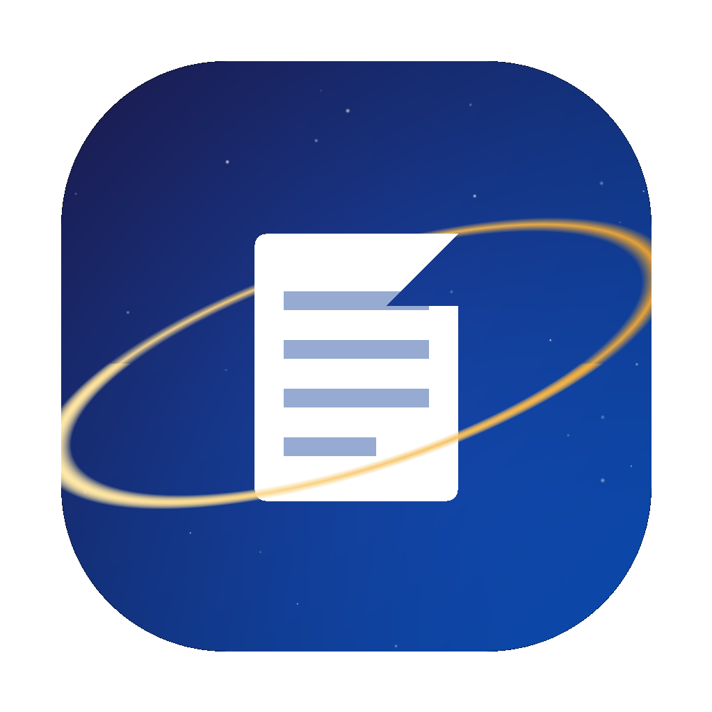

# Astra

Eine Werkzeugsammlung für macOS (Apple Silicon). Erste App: ein voll ausgestatteter **PDF-Editor**.
Zweite App: ein **Konverter**. Weitere (Bild-Werkzeuge, Notizen …) sind als Kacheln auf der Startseite vorgesehen.

## Konverter

Dateien hineinziehen oder wählen, Zielformat je Datei einstellen, konvertieren. Ausgabe neben dem
Original oder in einen gewählten Ordner. Alles offline.

- **Bilder**: PNG · JPEG · WebP · BMP untereinander, und → PDF
- **PDF** → PNG/JPEG/WebP (pro Seite), → Text, → Word (`.docx`, Textinhalt); ← aus Bild
- **Dokumente**: DOCX · TXT · Markdown · HTML → PDF; DOCX → HTML/Text/Markdown
- **Audio**: MP3 · WAV · AAC · M4A · FLAC · OGG untereinander (FFmpeg-WASM)
- **Video**: MP4 · MOV · MKV · WebM · AVI untereinander; Video → MP3/M4A (Ton) oder GIF

PDF↔Word ist **textbasiert** (kein pixelgenaues Layout) – das ist ohne schwere externe Tools
offline nicht anders möglich.



## Aufbau

Astra startet mit einer **Startseite** (Launcher): kosmischer Hintergrund, Suche über Apps und
zuletzt geöffnete Dateien, App-Kacheln mit Tastatur-Kürzeln (`1`–`9` startet eine App, `/` fokussiert
die Suche). Von dort öffnet man eine App – aktuell den PDF-Editor.

Im PDF-Editor führt der Knopf **‹ Astra** oben links (oder `⇧⌘H`, oder das Menü *Darstellung →
Astra-Startseite*) jederzeit zurück zur Startseite; geöffnete Dokumente bleiben erhalten.

Ein PDF per **Doppelklick** oder **Rechtsklick → „Öffnen mit" → Astra** im Finder öffnet Astra
direkt im PDF-Editor (die gebaute App registriert sich als PDF-Handler, ohne die Vorschau als
Standard zu verdrängen). Drag & Drop aufs Fenster geht ebenso.

## PDF-Editor – Funktionen

**Ansehen**
- Fortlaufende / Einzel- / Doppelseitenansicht, stufenloser Zoom (Fit-Breite/-Seite, Pinch, Zoom-zu-Cursor)
- Auswählbarer Textlayer, Volltextsuche (`⌘F`) mit Treffer-Navigation
- Nachtmodus, Präsentationsmodus, native Menüleiste, Light/Dark automatisch
- Mehrere Dokumente in Tabs, „Zuletzt benutzt", Drag & Drop, „Öffnen mit"
- **Verschiebbare Seitenleisten** (Breite am Rand ziehen, Doppelklick = Standard), gespeichert
- **Tooltips**: kurzer Hover über einem Knopf zeigt, was er tut
- **Sichern / Exportieren** sichtbar oben rechts (zusätzlich `⌘S`, `⇧⌘S`, `⇧⌘E`)

**Seiten**
- Miniaturen-Seitenleiste mit **Drag-&-Drop-Umsortierung** und Mehrfachauswahl
- Drehen (±90° / 180°), löschen, duplizieren
- Einfügen: leere Seite, aus Bild (PNG/JPEG), aus anderem PDF
- **Zusammenführen** mehrerer PDFs (Reihenfolge per Ziehen)
- **Teilen** (Einzelseiten / alle N Seiten / Bereiche), in neues PDF extrahieren
- **Größe & Format**: Skalierung in %, auf A3/A4/A5/Letter/… bringen, Inhalt einpassen & zentrieren

**Bearbeiten & Annotieren**
- **Text schreiben**, **vorhandenen Text bearbeiten** (Original abdecken + neu setzen)
- **Text löschen / echt schwärzen** – Redaktion, die den Inhalt beim Sichern wirklich entfernt (MuPDF)
- **Text markieren**: Hervorheben, Unterstreichen, Durchstreichen und Schwärzen **rasten am Text ein**
  (wie eine Textauswahl über eine oder mehrere Zeilen ziehen); über Bild/Scan als freie Fläche
- Freihand, Formen (Rechteck, Ellipse, Linie, Pfeil), Bild, Notiz, Stempel
- **Unterschrift** hinzufügen: zeichnen, Bilddatei oder Namen tippen; gespeicherte Unterschriften
  zur Wiederverwendung
- Auswählen, Verschieben, Größe ändern, Deckkraft – mit vollständigem **Undo/Redo**

**Dokument-Werkzeuge**
- Wasserzeichen (diagonal / zentriert / gekachelt)
- Seitenzahlen & Bates, Kopf-/Fußzeile mit Platzhaltern, Metadaten
- **Komprimieren** (Bilder neu codieren – MuPDF), **Passwortschutz** setzen/entfernen (AES-256 – MuPDF)
- **OCR / Texterkennung** (Deutsch, Englisch u. a.), **Redaktions-Assistent** (E-Mail, Telefon, IBAN …)
- **Stapelverarbeitung** (Wasserzeichen / Seitenzahlen / Komprimieren / Zusammenführen über viele Dateien)

**Export**: PDF-Kopie, Seitenbereich als PDF, Seiten als PNG/JPEG (frei wählbare DPI)

## Entwicklung

```bash
npm install
# npm blockiert Install-Scripts; einmalig freigeben:
npm install-scripts approve electron esbuild fsevents

npm run dev          # Astra mit Hot Reload
npm run typecheck
npm run build        # Produktions-Build nach out/
npm run dist         # .app + .dmg nach release/  (arm64, unsigniert)
npm run dist:dir     # nur .app
npm run icon         # resources/icon.png neu erzeugen
npm run test-pdf     # test/beispiel-mit-bild.pdf neu erzeugen
```

`predev` / `prebuild` kopieren pdf.js- und Tesseract-Assets nach `src/renderer/public/`.

### Screenshot-Hilfe (nur im Dev-Build aktiv)

`PDFSTUDIO_SHOT=/pfad/bild.png PDFSTUDIO_OPEN=/pfad/test.pdf npm run dev` startet Astra, öffnet
das PDF, macht nach `PDFSTUDIO_SHOT_DELAY` ms (Standard 3000) einen Screenshot und beendet sich.

## Installation der gebauten App

**Nicht signiert.** Beim ersten Start: Rechtsklick auf „Astra.app" → „Öffnen"
(oder Systemeinstellungen → Datenschutz & Sicherheit → „Dennoch öffnen").

## Technik

| Bereich | Bibliothek |
| --- | --- |
| Shell / Packaging | Electron 33, electron-vite, electron-builder |
| UI | React 18 + TypeScript, handgeschriebenes CSS-Token-System, zustand + immer |
| Rendern | pdf.js (`pdfjs-dist`) |
| Bearbeiten / Export | `pdf-lib` + `@pdf-lib/fontkit` |
| Redaktion / Verschlüsselung / Kompression | `mupdf` (WASM, im Web-Worker) |
| OCR | `tesseract.js` (Sprachdaten werden bei Bedarf via jsDelivr geladen und lokal gecacht) |
| Drag & Drop | `@dnd-kit` |

## Lizenz

Astra steht unter **AGPL-3.0-or-later** (siehe `LICENSE`). Grund: die Bibliothek **`mupdf`**
(echte Schwärzung, Verschlüsselung, Kompression) ist AGPL-3.0. „Nicht kommerziell" ändert daran
nichts – die AGPL verlangt bei Weitergabe die Offenlegung des kompletten Quellcodes unter AGPL,
was ein öffentliches Repo erfüllt.

Weitere Bibliotheken: pdf.js (Apache-2.0), pdf-lib (MIT), tesseract.js (Apache-2.0),
@dnd-kit (MIT), zustand/immer/nanoid/clsx (MIT).

## Bekannte Grenzen

- „Vorhandenen Text bearbeiten" deckt das Original ab und setzt neuen Text darüber (kein echtes Reflow).
- Text-Einrasten & Annotationen auf **gedrehten** Seiten werden näherungsweise positioniert.
- OCR und der MuPDF-Worker laufen im Electron-Renderer und sollten nach der Installation einmal
  praktisch geprüft werden.
